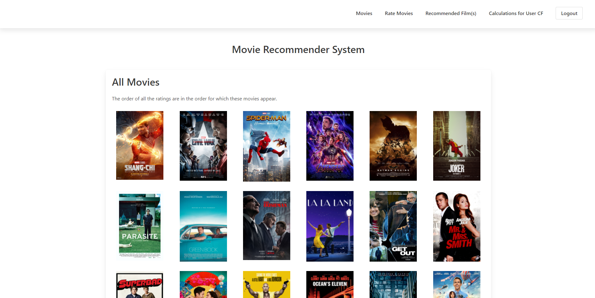
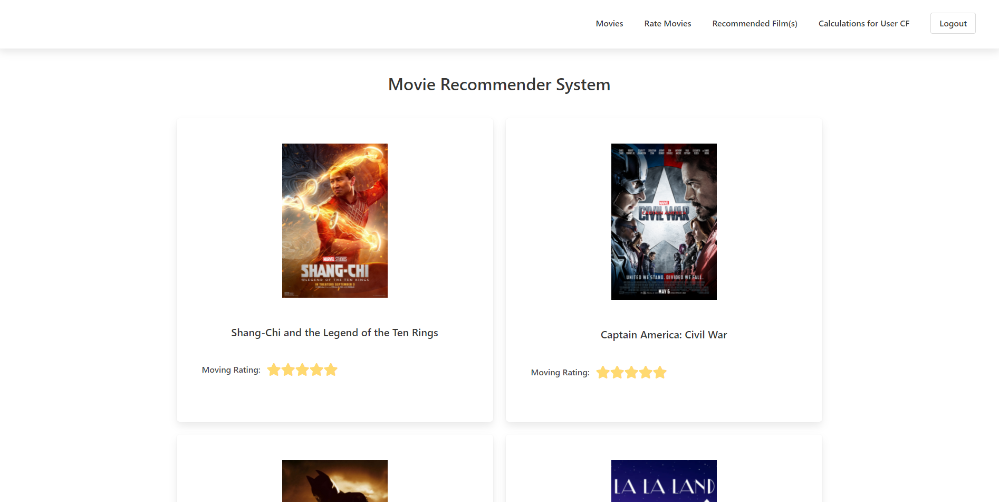
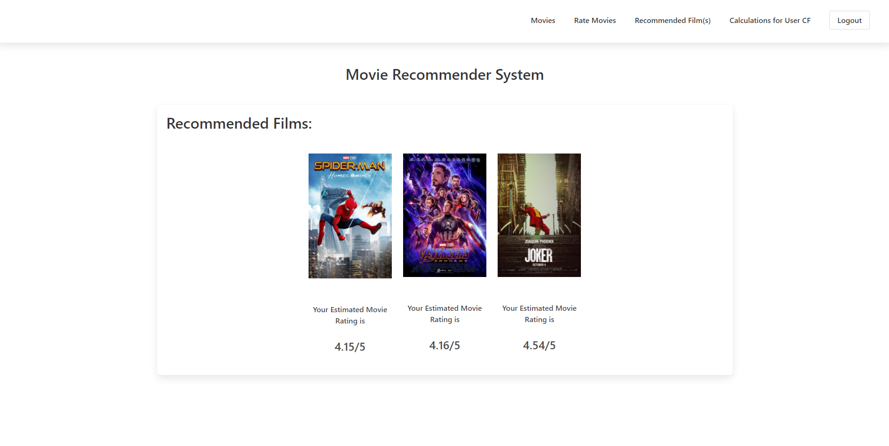
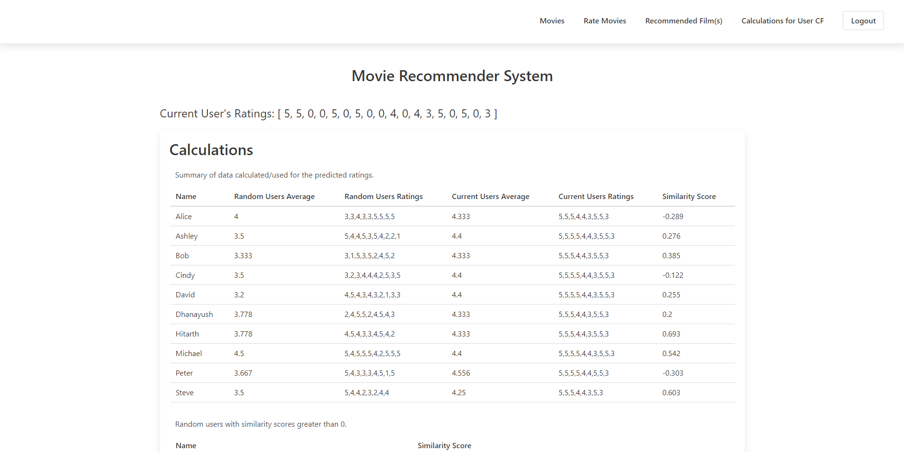

# 📌 Group Members

- Michael Pereira (500896409)
- Hitarth Chudgar (500888845)
- Dhanayush Raninga (500967245)

# 🍿🎞️ Movie Recommender System

This project requires [node.js](https://nodejs.org/en/download/).

## Build Setup

```bash
# install dependencies
$ yarn install 

# serve with hot reload at localhost:8080
$ yarn dev

# build for production and launch server
$ yarn build
$ yarn start
```

Alternatively, can use *npm* instead of yarn.

## 📚 Frameworks

-   _Nuxt.js_ - for building user interfaces and connecting Javascript/Typescript code
-   _Bulma_ - for UI components and styling

## 🔐 Back-End

### Dependencies

-   _express_ - for running a server locally to access local files

## 🎨 Front-End

### Dependencies

- _Buefy_ - for using UI components for Vue.js based on Bulma
- _axios_ - for the promise based HTTP client to handle requests

## 📷 Gallery






View more images under the ```./static/gallery/``` directory.

## 📝 Program Details

### Recommendation algorithm - User Based Collaborative Filtering 

- We made use of the collaborative filtering method to recommend relevant movies to the user based on the similarity score and by using the formula to predict the rating that user would give for the movie. 
- User-Based Collaborative Filtering is a technique for predicting which products a user would enjoy based on the ratings provided to that item by other users with similar tastes to the target user.
- Firstly, we made use of average aggregate function to determine the averages of user ratings as follows:


- Secondly, for the similarity score calculation we used the average based formula as follows:
Sim(X,Y) = Numerator/Denominator

- Lastly, we made use of predictive rating formula to predict the rating of the movie by the user, and pass it through the threshold:
R(X, Runknown) = (sim(X, A)*r(A, Rknown) + sim(X, D)*r(D, Rknown))/(sim..+sim..)


### Main functions/methods used 

- User Rating and Mapping 
This is used to declare random initial ratings that map to the relevant movies (this can set up initial recommendations, and it changes later on as new users are signing up and rating movies)

```
  // Predefined User Ratings (Randomly Generated from 0-5)
  private static randomUsersOriginalRatings: any = {
    Alice: [3, 0, 1, 2, 3, 3, 4, 3, 4, 3, 4, 3, 5, 5, 4, 5, 4, 5],
    Ashley: [5, 4, 5, 4, 4, 5, 5, 0, 4, 3, 4, 5, 4, 2, 5, 2, 3, 1],
    Bob: [0, 3, 2, 2, 1, 3, 5, 5, 5, 3, 3, 5, 2, 4, 3, 5, 3, 2],
  }
  
   // Mapping of transformed the ratings' data
  // Each predefined user is denoted as a 'random user'
  private static usersRatingsMap: any = {
    Alice: {
      name: 'Alice',
      randomUsersAverage: 0,
      randomUsersRatings: [],
      currentUsersAverage: 0,
      currentUsersRatings: [],
      similarityScore: 0,
    }
```
- calculateUserCF

This is the main function that calculates the similarity scores and determines the predictive movies.

1) Calculate the Average of Each Person
```
const users = Object.keys(this.usersRatingsMap)
```
2) Hold array of similarity scores
```
const similarityScoreRanking: SimilarityScores[] = []
```
3) Calculate Similarity Scores
4) Must be greater than 3.5 (a rating of 3.5-5 means the user likes the movie, therefore is a recommendation)
```
 if (predictedMovieScore > 3.5) {
          recommendedMovies.push({
            id: movieIds[i],
            score: predictedMovieScore,
     })
 }
 ```
- Movie Dataset Information
This is used to store the sample diverse movie dataset (17 movies in total to maintain performance and loading speed)
1)An array is used to store the movies as constant variable (the movie name and their cover image)
```
export const movies = [
  'Shang-Chi and the Legend of the Ten Rings',
  'Captain America: Civil War',
  'Spider-Man: Homecoming',
]
```
```
export const movieImgUrls = [
  'https://mx.web.img3.acsta.net/pictures/21/08/10/10/22/2091196.jpg',
  'https://m.media-amazon.com/images/M/MV5BMjQ0MTgyNjAxMV5BMl5BanBnXkFtZTgwNjUzMDkyODE@._V1_.jpg',
```
- Login/Register
This is used to create the login and register page for users to login and create new account to rate movies respectively. Made use of live password checklist to make sure that the user selects a secure password.
```
export default class Register extends Vue {
  private username: string = '';
  private password: string = '';

  private async login() {
    await BuefyService.startLoading()
    await axios.post('/login', {
      username: this.username,
      password: this.password,
      db: WebStorageService.checkForData()
    }).then(() => {
      WebStorageService.authorizeUser(this.username);
      BuefyService.successToast('User Authorized')
      this.$router.push('/movies')
    }).catch(error => {
      BuefyService.dangerToast(error.response.data.error)
    })
    await BuefyService.stopLoading()
  }

  get invalid() {
    return this.username.length < 3 || this.username.length > 32 || this.password.length < 3 || this.password.length > 64
  }

  mounted() {
    if (WebStorageService.getCurrentAuthorizedUser() !== null) {
      this.$router.push('/movies')
    }
  }
}
```


