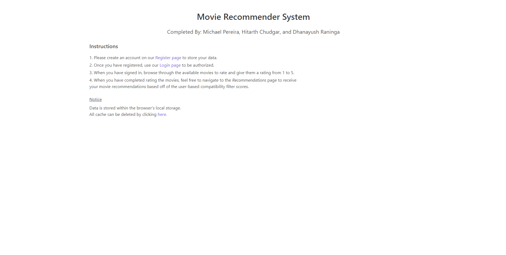

# 📌 Group Members

- Michael Pereira (500896409)
- Hitarth Chudgar (500888845)
- Dhanayush Raninga (500967245)

# 🍿🎞️ Movie Recommender System

This project requires [node.js](https://nodejs.org/en/download/).

## Build Setup

```bash
# install dependencies
$ yarn install 

# serve with hot reload at localhost:8080
$ yarn dev

# build for production and launch server
$ yarn build
$ yarn start
```

Alternatively, can use *npm* instead of yarn.

## 📚 Frameworks

-   _Nuxt.js_ - for building user interfaces and connecting Javascript/Typescript code
-   _Bulma_ - for UI components and styling

## 🔐 Back-End

### Dependencies

-   _express_ - for running a server locally to access local files

## 🎨 Front-End

### Dependencies

- _Buefy_ - for using UI components for Vue.js based on Bulma
- _axios_ - for the promise based HTTP client to handle requests

## 📷 Gallery



View more images under the ```./static/gallery/``` directory.

## 📝 Program Details
